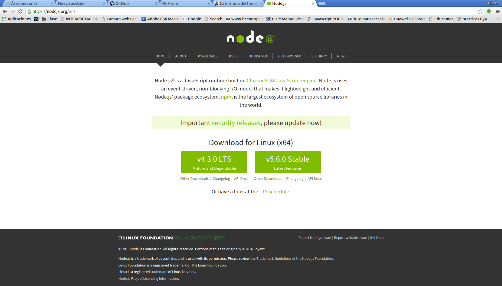
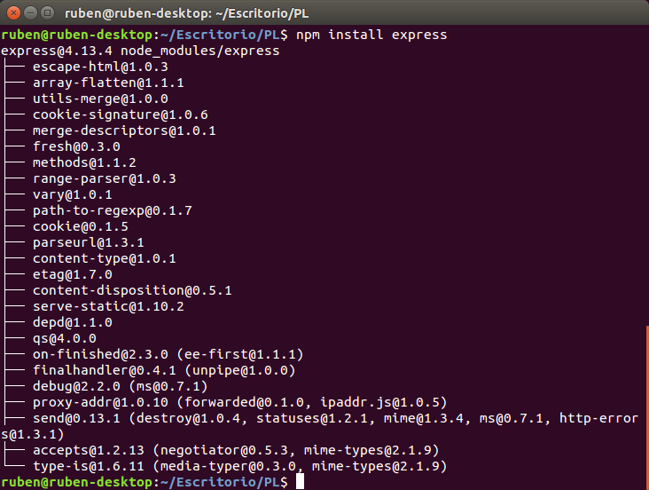
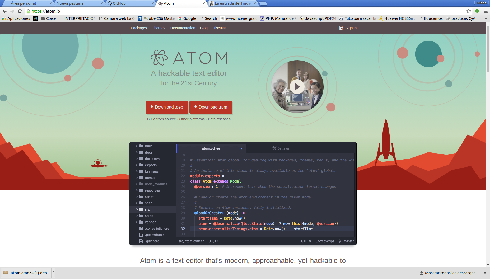
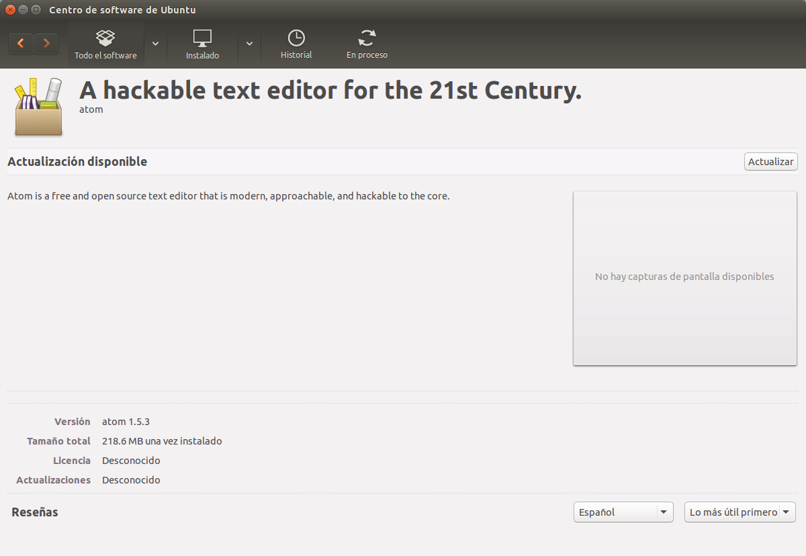
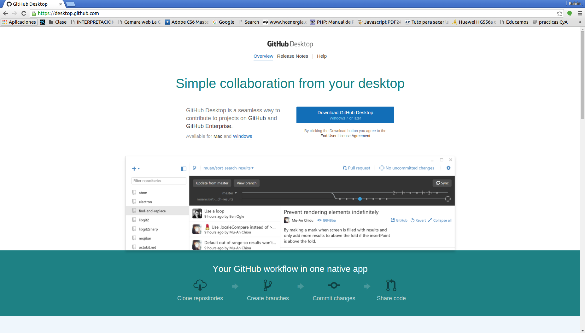
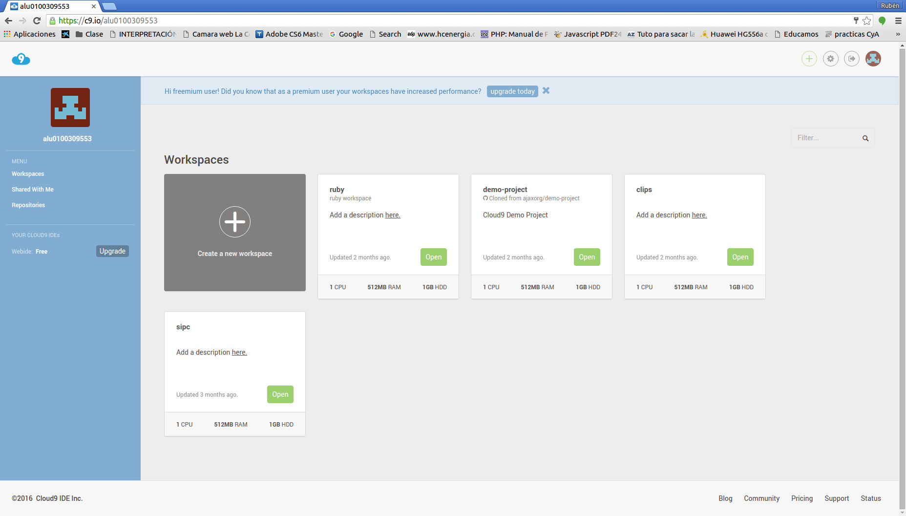
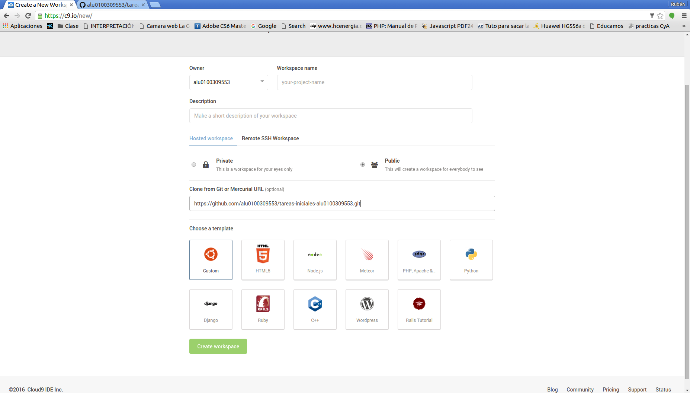
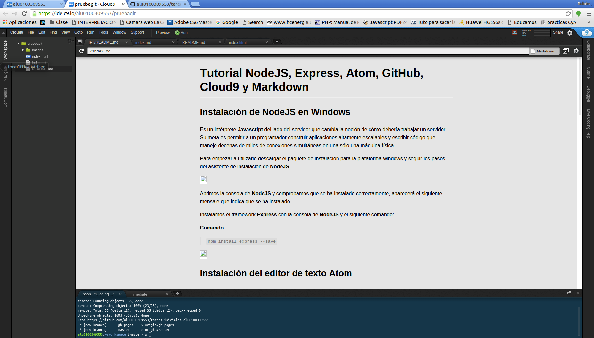
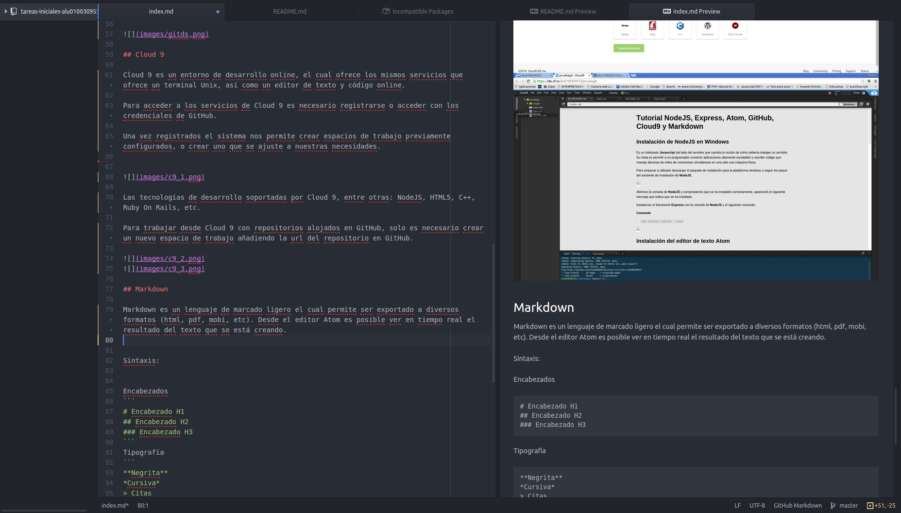

# Configuración del entorno de desarrollo para la asinatura Procesadores del Lenguaje

## Contenido
1. Node JS
2. Express
2. Atom
3. GitHub
4. Cloud9
5. Markdown

## Instalación de NodeJS en Ubuntu:

NodeJS es un entorno en tiempo de ejecución con arquitectura orientada a eventos que actúa del lado del servidor. Es de código abierto y está basado en el motor V8 de Google.

Para la instalación de NodeJS en ubunto existen dos métodos:
* Consola de comandos:


Este método es muy sencillo y rápido de realizar, pero en cambio instala una versión obsoleta de NodeJS.
* Descarga:

Para la descarga de NodeJS debemos dirigirnos a la página [**https://nodejs.org**](https://nodejs.org) y descargar una de las versiones existentes.



Al descomprimir el paquete descargado ya podemos hacer uso del node, aunque debemos dirigirnos a la carpeta /bin para poder ejecutarlo. Copiando el el archivo ejecutable Node a la carpeta **usr/bin** del sistema podemos hacer usuo del comando node desde cualquier parte del sistema.


Al instalar NodeJS se nos instala también el gestor de paquetes **NPM** (node package manager). Este gestor de paquetes nos permite instarlar software adicional para uso de NodeJS.

## Express:
Express es un framework para el desarrollo de aplicaciones web y móviles basado en NodeJS. Para la instalación de express debemos dirigirmos, en el terminal, a la carpeta donde queremos descargar los archivos necesarios y desde ejecutar el siguiente comando:

 > `npm install express`



## Atom:

Atom es un editor de textos que soporta diversos lenguajes de programación, este editor es libre y de código abierto. Mediante la adición de plugins se puede adaptar el sistema a cualquier uso, permitiendo ampliar las características del mismo en función de nuestras necesidades.

Para la instalación **Atom** debemos descargar la versión que se adapte a nuestro sistema operativo de la página web de Atom [https://atom.io](https://atom.io).



Una vez descargado el paquete lo ejecutamos y se instala con el centro de software de Ubuntu.



## GitHub

GitHub es una plataforma web que da soporte al desarrollo de software ofreciendo un sistema de repositorios online. Github hace uso del sistema de control de versiones **Git**. En Ubuntu se puede utilisar desde el terminal con los comandos del sistema Git.
Para Windows y MacOS existe un cliente gráfico que permite hacer uso de los servicios de GitHub.



## Cloud 9

Cloud 9 es un entorno de desarrollo online, el cual ofrece los mismos servicios que ofrece un terminal Unix, así como un editor de texto y código online.

Para acceder a los servicios de Cloud 9 es necesario registrarse o acceder con los credenciales de GitHub.

Una vez registrados el sistema nos permite crear espacios de trabajo previamente configurados, o crear uno que se ajuste a nuestras necesidades.




Las tecnologías de desarrollo soportadas por Cloud 9, entre otras: NodeJS, HTML5, C++, Ruby On Rails, etc.

Para trabajar desde Cloud 9 con repositorios alojados en GitHub, solo es necesario crear un nuevo espacio de trabajo añadiendo la url del repositorio en GitHub.




## Markdown

Markdown es un lenguaje de marcado ligero el cual permite ser exportado a diversos formatos (html, pdf, mobi, etc). Desde el editor Atom es posible ver en tiempo real el resultado del texto que se está creando.



La sintaxis es simple, se emplea una serie de caracteres reservados para indicar que es cada elemento en el téxto. A continuación se indica los elementos más usados del lenguaje.

### Títulos
```
# Título 1
## Título 2
### Título 3
Párrafo
```
Resultado

* # Título 1
* ## Título 2
* ### Título 3
* Párrafo

### Tipografía
```
**Negrita**
*Cursiva*
> Citas
Parrafo separar por lineas en blanco
`Codigo`
```
Resultado

**Negrita**

*Cursiva*

> Citas

Parrafo separar por lineas en blanco

`Codigo`

### Links
```

* [Links](https://example.com)
```
Resultado

* 

* [Links](https://example.com)

### Listas

```
Lista ordenda
1. Lista 1
2. Lista 2

Lista no ordenada
* Lista 1
* Lista 2
```
| Resultado

Lista ordenda
1. Lista 1
2. Lista 2

Lista no ordenada
* Lista 1
* Lista 2


> * Markdown preview `ctrl+shift+m`
> * Markdown export to HTML `Save As HTML`

## Recursos

* [NodeJS](https://nodejs.org)
* [Express](http://expressjs.com)
* [Atom IDE](https://atom.io)
* [GitHub Desktop](https://desktop.github.com)
* [GitHub Pages](https://pages.github.com/)
* [Cloud 9 IDE](https://c9.io)
* [Markdown](http://daringfireball.net/projects/markdown/)
* [Tutorial de Markdown Español](http://joedicastro.com/pages/markdown.html)
* [Resultado del Markdown HTML](http://alu0100309553.github.io/tareas-iniciales-alu0100309553/)
